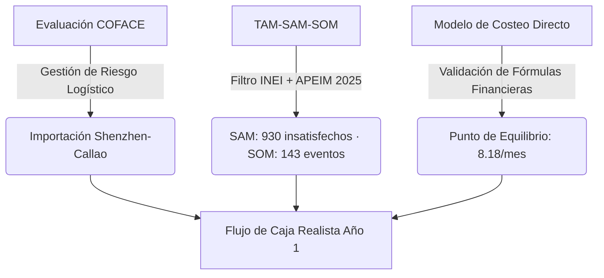
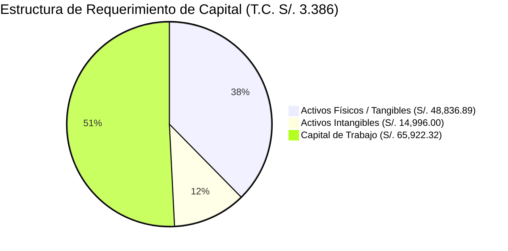
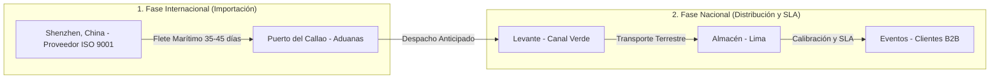

# INFORME DE VIABILIDAD DEL PROYECTO

## GLOBAL EVENT IMPORTS S.A.C.
**Empresa Importadora y Proveedora de Servicios B2B de Tecnología Interactiva para Eventos**

---

### DATOS DE IDENTIFICACIÓN

| Item | Detalle |
|------|---------|
| **Empresa** | Global Event Imports S.A.C. |
| **Giro** | Importación y alquiler B2B de tecnología interactiva |
| **Ubicación** | Lima, Perú (Almacén: Lima) |
| **Equipo** | 1. [100%] Jahir Castillo Cuevas 2. [100%] Jostin Chavez Estela 3. [100%] Marilin Andrea Medina Apolinario 4. [100%] Eric Mozombite Shishco 5. [100%] María Ruiz Luna |
| **Ciclo** | 2026-II |
| **Docente** | Mg. Jaime Orlando Chávez Tasayco |

---

## 1. RESUMEN EJECUTIVO

### 1.1. Definición y Oportunidad del Negocio
**Global Event Imports S.A.C.** se constituye como una empresa peruana de base importadora y proveedora de servicios tecnológicos B2B de alto valor agregado, enfocada en la adquisición, internamiento y operación técnica de ecosistemas de entretenimiento visual interactivo de última generación. La oferta comercial incluye cuatro líneas clave de hardware de alta tecnología:
*   **Glam & Motion 360°:** Plataformas giratorias motorizadas de fibra de carbono para capturas en cámara lenta de alta resolución.
*   **Interactive Magic Mirror:** Cabinas de fotografía de cuerpo entero con interfaces táctiles e interactividad animada.
*   **Immersive Booths:** Estructuras inflables de diseño envolvente con iluminación LED inteligente sincronizada.
*   **Vintage Audio-Guestbooks:** Teléfonos clásicos reacondicionados para la grabación digital de mensajes de voz en alta fidelidad.

El negocio se orienta al segmento de eventos corporativos, lanzamientos de marca, ferias comerciales y bodas de alta gama en Lima Metropolitana (Nivel Socioeconómico A y B), respondiendo a la creciente demanda por marketing experiencial y social media marketing inmediato.

### 1.2. Propuesta de Valor Estratégica
*   **Sostenibilidad y Ecoeficiencia Operativa (Modelo Capex Reusable):** La propuesta comercial rompe con el esquema tradicional de producción de eventos (florería, estructuras de un solo uso, papelería impresa), el cual genera entre un 10% y 15% de merma física directa (basura). Nuestro portafolio opera bajo el concepto de **"Zero-Merma"**, explotando activos fijos reusables de larga vida útil y reemplazando recuerdos impresos por descargas instantáneas en la nube mediante códigos QR generados in-situ.
*   **Garantía y Continuidad Operativa (SLA B2B):** Ofrecemos un estándar operativo de alta confiabilidad en el sector, respaldado por un indicador **OTIF (On-Time In-Full) superior al 96%** (montaje y calibración listos 45 minutos antes de la apertura del evento). La infraestructura de red cuenta con conectividad Multi-Carrier (módems portátiles de doble SIM que alternan automáticamente entre Claro y Movistar), lo que garantiza la entrega de archivos digitales a los invitados en menos de 12 segundos, eliminando la dependencia del internet del local.

### 1.3. Conclusión de Viabilidad Global
El proyecto demuestra viabilidad integral. A nivel legal, elimina barreras aduaneras al excluir estrictamente productos restringidos por regulaciones complejas (como DIGEMID). Financieramente, requiere un punto de equilibrio accesible (8.18 eventos/mes) y cuenta con una estructura de costos blindada que permite lograr rentabilidad operativa (EBITDA de S/. 55,267.50) desde el primer año, respaldada por un sólido fondo de contingencia de S/. 41,400.00 y un ROI de 12.89%.

---

## 2. METODOLOGÍA DE ANÁLISIS

El dimensionamiento del negocio se sustentó en un enfoque cuantitativo y cualitativo riguroso, utilizando herramientas de validación externa y modelos de costeo directo:

*   **Análisis de Riesgo Macro-Logístico (Metodología COFACE):** Para mitigar la incertidumbre en la cadena de suministro internacional (proveedores en Shenzhen y Guangzhou, China), se analizaron los reportes COFACE. El Riesgo País de Perú calificado en **A4 (Moderado)** y un Clima de Negocios de **A4 (Aceptable)** sirvieron de línea base para definir los márgenes de fluctuación cambiaria y los tiempos de tránsito del flete marítimo (estimados en 35 a 45 días calendario bajo régimen de despacho anticipado).
*   **Estimación de Demanda y Participación de Mercado (TAM / SAM / SOM):** El dimensionamiento del mercado sigue el marco TAM-SAM-SOM, aplicado sobre datos cuantitativos de fuentes oficiales:
    *   **TAM (Mercado Total Disponible):** Partiendo de Lima Metropolitana (10,432,133 habitantes, INEI 2025) y filtrando sucesivamente por PEA de 18 a 64 años (65%), NSE A/B (25.2%, APEIM 2025), poder adquisitivo de la PEA ocupada (95.7%) e interés en tecnología interactiva (15%, ENAHO), con un consumo per cápita de 0.10 eventos premium anuales, se determina una **Demanda Potencial de 24,530 eventos anuales**.
    *   **SAM (Mercado Disponible Servible):** Descontada la **Demanda Aparente** de la oferta existente (producción local + importación − exportación = 23,600 eventos), resulta una **Demanda Insatisfecha de 930 eventos anuales** — el segmento que la competencia actual no está cubriendo y al que Global Event puede servir directamente.
    *   **SOM (Mercado Obtenible Servible):** La meta de **143 eventos** representa una **participación del 15.38%** sobre la demanda insatisfecha (SOM = Meta ÷ SAM), calculada dinámicamente sin presuponer un market share fijo. Esta participación se alinea con la capacidad operativa instalada por fases.
*   **Estructura Financiera Integrada (Modelo de Costeo Directo):** La validación financiera se diseñó mediante un modelo de doble entrada en Excel, asegurando que las variables tributarias (como el IGV de importación de 18%, acreditable como crédito fiscal) y macroeconómicas (inflación anual del 2.50% proyectada por el BCRP) interactúen de forma dinámica con los costos fijos y variables. Las proyecciones operativas se simularon bajo escenarios realista, optimista y pesimista para determinar la resistencia del capital de trabajo neto.

---

## 3. SUPUESTOS CLAVE DEL NEGOCIO

Todos los cálculos y proyecciones de rentabilidad operativa se basan en los siguientes parámetros técnicos de entrada, alineados con el tipo de cambio oficial de la SUNAT (**S/. 3.386 por USD**) y la estructura financiera real del proyecto.

### Tabla 3.1: Supuestos Operacionales y Comerciales (Año 1)

| Métrica Operativa | Valor Proyectado | Fundamentación Técnica |
| :--- | :---: | :--- |
| **Ticket Promedio Ponderado** | S/. 1,172.50 | Promedio de ventas ponderado del mix de servicios: Bodas de lujo/Corporativos (S/. 2,200.00) y Eventos sociales estándar (S/. 700.00). |
| **Costo Variable Promedio** | S/. 400.00 | Incluye flete local, consumibles, licencias de software fotográfico Cloud, internet móvil multi-carrier y nómina de operarios part-time. |
| **Margen de Contribución Unitario** | S/. 772.50 | S/. 1,172.50 (Precio) - S/. 400.00 (Costo Variable). Representa el 65.88% de los ingresos por evento. |
| **Meta Operativa (Año 1)** | 143 Eventos | Participación del 15.38% sobre la demanda insatisfecha anual (930 eventos) del segmento objetivo. |

### Tabla 3.2: Supuestos Financieros y Costos Estructurales (Lean)

| Cuenta Financiera / Inversión | Monto (S/.) | Naturaleza del Gasto / Criterio Contable |
| :--- | :---: | :--- |
| **Nómina Fija de Jefaturas** | S/. 3,000.00 | Retribución mensual total de los socios directores de campo (S/. 1,000.00 c/u por roles de Operación, Logística y Ventas). |
| **Alquiler Logístico / Almacén** | S/. 0.00 | Optimización Lean. Uso de espacio propio residencial acondicionado para almacenamiento inicial y calibración de equipos. |
| **Servicios Generales y Software** | S/. 800.00 | Desglosado en: S/. 400.00 de internet centralizado y suministro eléctrico; y S/. 400.00 de licencias de software interactivo. |
| **Activos Físicos / Tangibles (Fase 1)** | S/. 48,836.89 | Valor DDP de los activos físicos importados y equipos complementarios en almacén (sin incluir IGV). |
| **Activos Intangibles (Fase 1)** | S/. 14,996.00 | Gastos de formalización de empresa, registros, licencias de software, web e-commerce y capacitación. |
| **Capital de Trabajo Neto** | S/. 65,922.32 | Incluye el fondo de contingencia intocable de S/. 41,400.00 (planilla fija de 6 meses) y caja operativa inicial. |
| **Inversión Inicial Total** | S/. 129,755.21 | Suma de Activos Tangibles (S/. 48,836.89), Activos Intangibles (S/. 14,996.00) y Capital de Trabajo (S/. 65,922.32). |

### Tabla 3.3: Parámetros Macroeconómicos y Tributarios

| Parámetro Clave | Tasa / Valor | Fuente de Información y Cumplimiento Normativo |
| :--- | :---: | :--- |
| **Tipo de Cambio (S/./USD)** | 3.386 | SUNAT (Superintendencia Nacional de Aduanas y de Administración Tributaria). |
| **Tasa de Inflación Anual** | 2.50% | BCRP (Banco Central de Reserva del Perú) - Reporte de Inflación. |
| **Impuesto General a las Ventas (IGV)** | 18.00% | SUNAT (16% IGV + 2% Impuesto de Promoción Municipal en importaciones y ventas locales). |
| **Impuesto a la Renta MYPE** | 10.00% | Régimen MYPE Tributario (SUNAT) aplicable para las primeras 15 UIT de utilidad neta. |

### Figura 1: Distribución del Presupuesto de Inversión Inicial (Fase 1)

---

## 4. ANÁLISIS DEL ENTORNO Y DEL MERCADO

### 4.1. Matriz PESTEL (Análisis de Variables Macro)
*   **Político:** El Perú mantiene un marco comercial abierto. El **Tratado de Libre Comercio (TLC) con China** es una variable política clave, ya que permite la importación del portafolio tecnológico interactivo (CAPEX) desde Shenzhen con preferencias arancelarias (Ad Valorem 0% (100% liberado bajo TLC Perú-China, Convenio 805, vigente desde 2022)), facilitando una estructura de costos competitiva.
*   **Económico:** El sector de eventos premium en Lima Metropolitana registra un crecimiento proyectado del **18% anual** (según análisis COFACE). Las proyecciones financieras del proyecto utilizan una tasa de inflación anual controlada de **2.5%** y el tipo de cambio oficial de la SUNAT de **S/. 3.386 por USD** para la cotización del hardware. Asimismo, la viabilidad se apoya en un financiamiento mixto con un préstamo bancario de S/. 40,000.
*   **Social:** Existe una fuerte tendencia en los sectores socioeconómicos A y B de Lima hacia la contratación de "experiencias digitales inmersivas". Los organizadores de bodas y corporativos demandan inmediatez y espectacularidad. Adicionalmente, el consumidor valora la sostenibilidad, lo que favorece nuestra propuesta al eliminar los plásticos y recuerdos impresos de un solo uso por descargas QR en menos de 12 segundos.
*   **Tecnológico:** La importación directa de Shenzhen nos da acceso a hardware de última generación: plataformas motorizadas 360° de fibra de carbono, pantallas táctiles de alta definición para espejos mágicos, cabinas inflables LED inmersivas y telefonía retro para Audio-Guestbooks vinculados a servidores en la nube. La inclusión de routers portátiles Multi-Carrier (con doble SIM de respaldo Claro/Movistar) mitiga la debilidad tecnológica de venues con mala conectividad.
*   **Ecológico (Ambiental):** Nuestro modelo B2B destaca por ser **"Zero-Merma"**. A diferencia de la decoración estática tradicional, que genera entre 10% y 15% de residuos físicos no reciclables por evento (flores rotas, plásticos, maderas), nuestro portafolio digital genera cero residuos de consumo directo en el local del evento.
*   **Legal:** Operamos bajo estricto cumplimiento normativo en el Perú. El presupuesto asigna **S/. 800** para el registro de la personería jurídica ante SUNARP, registro de marca comercial ante INDECOPI, la obtención de licencias de funcionamiento municipales y la contratación obligatoria del seguro SCTR (Seguro Complementario de Trabajo de Riesgo) para proteger la salud de los operarios durante el montaje de campo.

### 4.2. Benchmarking (Análisis Competitivo)
Analizamos a los competidores directos en el mercado de entretenimiento visual en Lima Metropolitana:

| Dimensión de Análisis | Celebranza | Espejo Mágico Perú | Selfie Booth Perú | **Global Event Imports** |
| :--- | :--- | :--- | :--- | :--- |
| **Portafolio de Equipos** | Limitado (solo cabinas de fotos tradicionales) | Monotemático (solo espejos interactivos) | Enfocado en tótems estándar | **Diversificado (4 líneas: 360°, espejos, cabinas LED, audio-guestbooks)** |
| **Velocidad de Descarga** | Lenta (30 - 45 segundos por correo) | Media (vía código manual) | Lenta (depende del wifi del local) | **Ultra-rápida (<12 segundos vía QR con router Multi-Carrier)** |
| **Logística y Confiabilidad** | Informal (entregas con demoras recurrentes) | Aceptable, pero con sobrecostos logísticos | Masiva pero descuidada en eventos premium | **Garantizada (OTIF 96% semanal, montajes listos 45 min antes)** |
| **Estructura de Precios** | Ticket alto por insumos físicos (S/. 1,500+) | Elevado, orientado a grandes marcas | Bajo, pero con tecnología obsoleta | **Ticket promedio B2B competitivo (S/. 1,172.50)** |

### 4.3. Matriz FODA Cruzada
Sintetizamos los factores internos (Fortalezas y Debilidades) y externos (Oportunidades y Amenazas) para generar estrategias accionables:

#### 🌟 Factores Internos
*   **Fortalezas (F):**
    1.  Portafolio real diversificado de 4 líneas tecnológicas interactiva de vanguardia.
    2.  Compromiso logístico medible: OTIF semanal del 96% y descargas en <12 segundos.
    3.  Control preventivo estricto (clasificación ABC de almacén y mantenimiento semanal).
*   **Debilidades (D):**
    1.  Marca nueva en el mercado local B2B de Lima.
    2.  Alta dependencia inicial de importaciones y variaciones del tipo de cambio.
    3.  Curva de aprendizaje en la calibración inicial de operarios técnicos part-time.

#### ⚡ Factores Externos
*   **Oportunidades (O):**
    1.  Mercado de eventos premium en Lima crece 18% anual en sectores A/B.
    2.  Beneficios arancelarios del TLC Perú-China para la compra de CAPEX.
    3.  Aumento del interés de Wedding Planners por propuestas de valor digitales sostenibles.
*   **Amenazas (A):**
    1.  Ingreso de competidores informales de bajo costo con tecnología clonada.
    2.  Volatilidad macroeconómica y fluctuaciones bruscas en el tipo de cambio del dólar.
    3.  Cambios repentinos en normativas de importación aduanera en el Callao.

#### 🔀 Cruces Estratégicos
*   **Estrategias FO (Maxi-Maxi):**
    *   **FO-01:** Utilizar el portafolio diversificado de 4 líneas y la garantía OTIF del 96% para cerrar **contratos marco de exclusividad** con Wedding Planners premium, aprovechando el crecimiento del 18% en el sector de bodas de lujo (F1, F2, O1, O3).
    *   **FO-02:** Aprovechar las ventajas del TLC con China para adquirir repuestos adicionales y optimizar el kit de contingencia Clase A, asegurando la continuidad del servicio ante el crecimiento de la demanda (F3, O2).
*   **Estrategias DO (Mini-Maxi):**
    *   **DO-01:** Ejecutar **campañas de marketing digital B2B focalizadas** y demostraciones gratuitas *in-situ* (Expo Wedding) para posicionar rápidamente la nueva marca ante las agencias, aprovechando la alta demanda del sector (D1, O1, O3).
    *   **DO-02:** Optimizar la frecuencia de importación de equipos en fases consolidadas para diluir costos logísticos fijos y mitigar la exposición al tipo de cambio (D2, O2).
*   **Estrategias FA (Maxi-Mini):**
    *   **FA-01:** Diferenciarse de la competencia informal de bajo costo promoviendo el soporte técnico especializado *in-situ* y el uso de routers Multi-Carrier para descargas instantáneas (<12s), blindando la reputación B2B (F1, F2, A1).
    *   **FA-02:** Utilizar el estricto mantenimiento preventivo (clasificación ABC) para prolongar la vida útil de los activos fijos tecnológicos importados, reduciendo la necesidad de compras de reposición en periodos de volatilidad cambiaria (F3, A2).
*   **Estrategias DA (Mini-Mini):**
    *   **DA-01:** Implementar y defender el **fondo de contingencia intocable de S/. 41,400** (equivalente a 6 meses de planilla) para garantizar la solvencia y el pago de nómina de los socios ante meses de baja demanda o alzas cambiarias (D2, A2).
    *   **DA-02:** Establecer alianzas estratégicas con agentes de aduana experimentados para acelerar el régimen de despacho anticipado y evitar sobrecostos por demoras normativas (D2, A3).

### 4.4. Segmentación (Embudo de Mercado y Perfiles de Clientes)
El dimensionamiento sigue el embudo de demanda insatisfecha, partiendo de la población y filtrando hasta el público objetivo con poder adquisitivo e interés en el servicio:

| Criterio de Segmentación | % | Cantidad | Fuente |
| :--- | :---: | ---: | :--- |
| Población del Perú | 100% | 34,350,000 personas | INEI |
| Nicho de mercado (Lima Metropolitana) | 30.37% | 10,432,133 personas | INEI 2025 |
| Edad objetivo 18–64 años (PEA) | 65.0% | 6,780,886 personas | INEI |
| Nivel Socioeconómico A/B | 25.2% | 1,708,783 personas | APEIM 2025 |
| Poder adquisitivo (PEA ocupada A/B) | 95.7% | 1,635,306 personas | INEI |
| Interés en tecnología / eventos interactivos | 15.0% | 245,296 personas | INEI ENAHO |
| Consumo per cápita de eventos premium (anual) | 0.10 | **24,530 eventos/año** | Supuesto interno |
| **(=) Demanda Potencial** | | **24,530 eventos/año** | Personas objetivo × consumo |
| (−) Demanda Aparente (producción + importación − exportación) | | 23,600 eventos/año | SUNAT / Trade Map |
| **(=) Demanda Insatisfecha** | | **930 eventos/año** | Potencial − Aparente |
| **Participación requerida de Global Event** | **15.38%** | **143 eventos meta Año 1** | Eventos / Insatisfecha |

La participación se calcula de forma dinámica (Meta ÷ Demanda Insatisfecha), evitando un market share preestablecido. La meta de **143 eventos/año** (promedio de 12 mensuales) se alinea con la capacidad instalada por fases.

#### Perfiles de Clientes B2B (Prototipos)
*   **Perfil 1: "Grace - The Luxury Wedding Planner"**
    *   *Giro:* Bodas de alta gama en distritos del primer anillo (San Isidro, Miraflores, La Molina) y locaciones de campo (Cieneguilla, Pachacámac).
    *   *Dolor:* Sufre pérdidas constantes (hasta 15%) por rotura de mobiliario de decoración estático y retrasos en las entregas de proveedores tradicionales que afectan el cronograma estricto del evento.
    *   *Solución:* Le garantizamos puntualidad de montaje de 45 minutos antes (OTIF 96%) y un servicio interactivo espectacular que no genera mermas ni basura física.
*   **Perfil 2: "Colmena - Productora de Eventos Corporativos"**
    *   *Giro:* Activaciones de marca, ferias comerciales y lanzamientos de productos corporativos.
    *   *Dolor:* Caídas recurrentes del servicio de foto por mala señal de internet en los venues, lo que genera colas molestas de invitados y reclamos del cliente corporativo.
    *   *Solución:* Ofrecemos descarga ultra-rápida en menos de 12 segundos mediante routers Multi-Carrier que saltan automáticamente entre Claro y Movistar, eliminando la dependencia del internet del local.

---

## 5. RECURSOS CRÍTICOS Y RESTRICCIONES ORGANIZACIONALES

---

Esta sección detalla los recursos estratégicos necesarios para la operatividad diaria de Global Event Imports S.A.C., así como las restricciones financieras y normativas que condicionan las decisiones del equipo directivo. La clasificación y análisis preventivo de estas variables permiten resguardar la solvencia y la sostenibilidad del modelo de negocio a largo plazo.

### 5.1. Clasificación de Recursos Críticos
La operación de Global Event Imports S.A.C. depende de recursos estratégicos indispensables para asegurar la continuidad del servicio y el cumplimiento de las metas de calidad en el mercado B2B de eventos premium:

*   **Equipos interactivos importados (Activos de Categoría A):** Son el núcleo del negocio y la fuente principal de ingresos por alquiler. Se controlan semanalmente mediante un sistema de inventario ABC en almacén: Plataformas 360°, Espejos Mágicos interactivos, Cabinas LED e de Audio-Guestbooks. Debido a su importancia económica y operativa, estos activos se consideran recursos críticos de categoría A y están sujetos a mantenimiento preventivo semanal, conforme a las políticas corporativas.
*   **Conectividad Multi-Carrier de Respaldo:** Cada módulo de servicio en eventos incorpora routers portátiles con doble tarjeta SIM (respaldo automático entre Claro y Movistar). Esto garantiza que la descarga digital de archivos multimedia mediante códigos QR se efectúe en **menos de 12 segundos**, independientemente de la señal de red propia del local del evento.
*   **Almacén Central Logístico (Lima):** Ubicado estratégicamente para facilitar el despacho a venues en Lima Metropolitana. Funciona como el centro de control para la recepción de importaciones de Shenzhen, calibración previa al evento y ejecución del mantenimiento preventivo semanal.
*   **Talento Humano Técnico Especializado:**
    *   *Dirección Logística y Operativa:* Jostin (VP de Logística) lidera la cadena de suministro y despacho aduanero Callao-Shenzhen. Eric (VP de Operaciones) supervisa la calibración y el soporte técnico in-situ.
    *   *Personal de Campo:* Operarios entrenados con un mínimo de 15 horas de capacitación práctica en montaje y calibración de hardware. Cuentan obligatoriamente con póliza de seguro SCTR (Seguro Complementario de Trabajo de Riesgo) vigente.

### 5.2. Análisis de Restricciones Organizacionales
*   **Restricción de Capital de Trabajo: Fondo de Contingencia de S/. 41,400:** La empresa mantiene una reserva de liquidez equivalente a seis meses de planilla básica de los socios (S/. 3,000/mes) y gastos fijos mínimos de soporte, ascendente a S/. 41,400. Este fondo es de carácter intangible y únicamente puede utilizarse para cubrir obligaciones salariales y servicios en situaciones de emergencia financiera. Por tanto, dichos recursos no pueden destinarse a:
    *   Compra de existencias o consumibles de eventos.
    *   Financiamiento de campañas de marketing extraordinarias.
    *   Adquisición de activos fijos adicionales (CAPEX).
    
    *Nota: El saldo de caja neto en el escenario realista disminuye a su punto mínimo en el mes 5 (Marzo 2027) alcanzando S/. 25,721.83 (después de ejecutar el CAPEX de Fase 2), pero la reserva intocable de S/. 41,400 en capital de trabajo garantiza la solvencia operativa.*
*   **Restricción en CAPEX de Activos Fijos:** La adquisición de activos tecnológicos implica elevados desembolsos iniciales. Además, la política financiera establece la depreciación acelerada del hardware importado al 20% anual, por lo que las inversiones deben efectuarse de forma gradual y controlada. Las principales limitaciones son:
    *   Preservar la liquidez básica de la empresa.
    *   Evitar el sobreendeudamiento inicial (préstamo bancario acotado a S/. 40,000 a una TEA del 28%).
    *   Minimizar la devaluación cambiaria utilizando el tipo de cambio oficial SUNAT de **S/. 3.386 por USD**.
    *   Reducir el riesgo de obsolescencia tecnológica rápida.

### 5.3. Toma de Decisiones (Plan de Importación por Fases)
Las restricciones financieras obligan a adoptar una estrategia de importación escalonada del CAPEX, permitiendo mantener la solvencia y disminuir la exposición al riesgo:

*   **Fase 1: Importación inicial de 4 equipos (Mes 0):** Durante la etapa de introducción al mercado se importarán cuatro equipos interactivos (uno de cada línea), con el objetivo de validar la aceptación del servicio, generar flujo de caja inicial, reducir el monto de inversión inicial y preservar intacto el fondo de contingencia de S/. 41,400 (CAPEX inicial en activos tangibles de **S/. 63,832.89** más intangibles de formalización de S/. 800.00).
*   **Fase 2: Expansión a 8 equipos (Mes 5 - Marzo 2027):** Una vez alcanzada una demanda estable y un flujo de ingresos recurrente, se incrementará la capacidad instalada mediante la adquisición de cuatro equipos adicionales (CAPEX de Fase 2 de **S/. 34,147.22** financiado con utilidades acumuladas).
*   **Fase 3: Consolidación operativa (Mes 9 - Julio 2027):** La empresa completará un portafolio de ocho equipos operativos, maximizando la cobertura de eventos en fechas de alta demanda simultánea en Lima Metropolitana (meta anual de **143 eventos**).

---

## 6. VIABILIDAD TÉCNICA

---

La viabilidad técnica evalúa la capacidad física, operativa y logística de Global Event Imports S.A.C. para sostener un servicio confiable y puntual que cumpla con los estándares exigidos por nuestros clientes corporativos y wedding planners. A continuación, se detalla la gestión de nuestra capacidad instalada en Lima, el flujo de importación desde Shenzhen (China) y los procedimientos de mantenimiento y control de calidad.

### 6.1. Capacidad Instalada y Gestión de Almacén
El almacén central en Lima administra el stock de equipos y consumibles. Cuenta con un sistema de clasificación ABC para optimizar la seguridad y el espacio:
*   **Categoría A:** Equipos interactivos, cámaras GoPro, iPads, routers portátiles.
*   **Categoría B:** Estructuras metálicas de soporte, luminarias LED secundarias, cableado estructurado.
*   **Categoría C:** Consumibles de oficina, papel térmico de repuesto, fundas de flight cases.
La disponibilidad operativa proyectada es del **98.0% mensual**, gestionada mediante mantenimiento preventivo los días lunes y martes post-evento en Lima.

La selección de proveedores se realiza únicamente con fabricantes certificados, garantizando estándares internacionales de calidad. Todos los embarques se gestionan mediante la modalidad de despacho aduanero anticipado, permitiendo que la DAM sea numerada antes del arribo de la nave al puerto del Callao, reduciendo tiempos de permanencia y costos de almacenamiento en un 30%. Asimismo, se asignan las subpartidas arancelarias exactas de SUNAT para evitar reclamos o reajustes aduaneros.

### 6.3. Mantenimiento, Calibración y Soporte Técnico (SLA)
Todo equipo pasa por una prueba de software y calibración física 4 horas antes de salir del almacén hacia el venue. Los operarios deben contar con un kit de contingencia clase A in-situ (fusibles, cargadores portátiles adicionales, iPads de repuesto y doble SIM multi-carrier).
*   El SLA contractual exige que el módulo de servicios interactivos esté configurado y operativo **45 minutos antes** de que inicie el evento.
*   El tiempo de descarga de contenido multimedia por parte de los invitados debe mantenerse **menor a 12 segundos** mediante QR.

### 6.4. Matriz de Riesgos Técnicos y Mitigación

| Riesgo Técnico | Impacto | Probabilidad | Acciones de Mitigación y Plan B |
| :--- | :---: | :---: | :--- |
| **Falla crítica de hardware en pleno evento** | Alto | Baja | Kit de repuestos Clase A in-situ + backup de iPad/cámara en la maleta de transporte. |
| **Demora logística de importación en Callao** | Medio | Baja | Despacho aduanero anticipado + mantenimiento de un inventario de seguridad de partes críticas en Lima. |
| **Pérdida o corrupción de videos/audios de clientes** | Crítico | Muy baja | Backup inmediato en almacenamiento local redundante (tarjeta SD local) + sincronización automática a la nube. |
| **Falta de conectividad móvil en el local (venue)** | Medio | Media-Baja | Uso de routers Multi-Carrier configurados con doble chip Claro/Movistar activos con salto de red automático. |

### 6.5. Metas Técnicas y KPIs Operativos

| Indicador Técnico | Meta del KPI | Método de Medición |
| :--- | :---: | :--- |
| **Disponibilidad operativa de activos fijos** | 98.0% | Bitácora de mantenimiento semanal en almacén |
| **Cumplimiento de entrega OTIF (On Time In Full)** | 96.0% | Registro de incidencias y hora de entrega en eventos |
| **Tiempo de descarga multimedia por QR** | <12 segundos | Medición de velocidad en pruebas de campo con Multi-Carrier |
| **Margen de anticipación en el montaje** | 45 minutos | Registro de check-in del operario en el local del evento |
| **Nivel de satisfacción del cliente (NPS)** | >95.0% | Encuestas virtuales enviadas a Wedding Planners post-evento |

---

## 7. VIABILIDAD FINANCIERA

### 7.1. Proyecciones de Flujo de Caja (12 Meses)
El modelo financiero de Global Event Imports S.A.C. se fundamenta en la proyección y planificación de las siguientes variables para el primer año de operaciones (noviembre 2026 a octubre 2027), calculadas bajo el tipo de cambio oficial de la SUNAT de **S/. 3.386 por USD**:

*   **Volumen de Operaciones:** Se proyecta la realización de **143 eventos** en el año 1, siguiendo una rampa de crecimiento escalonada por fases de capacidad instalada (Fase 1: 8 eventos/mes max, Fase 2 y 3: 16 eventos/mes max).
*   **Ingresos Brutos:** Con un ticket promedio ponderado de **S/. 1,172.50** por evento, los ingresos totales del ejercicio ascienden a **S/. 167,667.50**.
*   **Costos y Gastos:**
    *   *Costos Variables:* S/. 57,200 (S/. 400 por evento, cubriendo insumos, movilidad y operarios técnicos part-time).
    *   *Gastos Administrativos Fijos:* S/. 45,600 anuales (S/. 3,800 mensuales que incluyen nómina de socios por S/. 3,000, servicios por S/. 400 y mantenimientos/licencias por S/. 400. Se opera desde domicilio/base propia sin pagar alquiler comercial en la primera fase).
    *   *Gastos de Ventas:* S/. 9,600 anuales (S/. 800 mensuales para marketing digital B2B).
*   **Resultado Neto:** La utilidad neta antes de intereses e impuestos (EBITDA) es de **S/. 55,267.50**. Tras la provisión de impuestos bajo el Régimen MYPE Tributario (10% sobre la renta neta) y el servicio de la deuda, se alcanza una utilidad neta final de **S/. 21,128.57**.
*   **Flujo Acumulado:** El flujo de caja financiero cierra el primer año con un saldo acumulado positivo de **S/. 57,686.74**, habiendo cubierto el servicio de deuda anual de **S/. 21,408.25** y manteniendo un colchón de solvencia mínimo de **S/. 25,721.83** en el mes más crítico (Marzo 2027, tras realizar la reinversión de CAPEX de la Fase 2).

#### Proyección de Flujo de Caja Mensual (Año 1)
El siguiente cuadro detalla las proyecciones financieras mensuales, mostrando la estabilidad del flujo y el impacto de la reinversión en CAPEX de la Fase 2 (S/. 34,147.22) en el mes 5:

| Mes | Eventos | Ingresos (S/.) | C. Var. (S/.) | G. Admin (S/.) | G. Ventas (S/.) | Deprec. (S/.) | EBIT (S/.) | Impuesto (S/.) | Serv. Deuda (S/.) | CAPEX F2 (S/.) | Caja Acum. (S/.) |
| :--- | :---: | :---: | :---: | :---: | :---: | :---: | :---: | :---: | :---: | :---: | :---: |
| *Saldo Inic.* | - | - | - | - | - | - | - | - | - | - | 60,322.32 |
| **Nov 2026** | 8 | 9,380.00 | 3,200.00 | 3,800.00 | 800.00 | 1,715.94 | -135.94 | -195.63 | -1,784.02 | 0.00 | 59,922.66 |
| **Dic 2026** | 8 | 9,380.00 | 3,200.00 | 3,800.00 | 800.00 | 1,715.94 | -135.94 | -195.63 | -1,784.02 | 0.00 | 59,523.01 |
| **Ene 2027** | 7 | 8,207.50 | 2,800.00 | 3,800.00 | 800.00 | 1,715.94 | -908.44 | -195.63 | -1,784.02 | 0.00 | 58,350.85 |
| **Feb 2027** | 8 | 9,380.00 | 3,200.00 | 3,800.00 | 800.00 | 1,715.94 | -135.94 | -195.63 | -1,784.02 | 0.00 | 57,951.20 |
| **Mar 2027** | 11 | 12,897.50 | 4,400.00 | 3,800.00 | 800.00 | 1,715.94 | 2,181.56 | -195.63 | -1,784.02 | -34,147.22 | 25,721.83 |
| **Abr 2027** | 12 | 14,070.00 | 4,800.00 | 3,800.00 | 800.00 | 1,715.94 | 2,954.06 | -195.63 | -1,784.02 | 0.00 | 28,412.17 |
| **May 2027** | 15 | 17,587.50 | 6,000.00 | 3,800.00 | 800.00 | 1,715.94 | 5,271.56 | -195.63 | -1,784.02 | 0.00 | 33,420.01 |
| **Jun 2027** | 14 | 16,415.00 | 5,600.00 | 3,800.00 | 800.00 | 1,715.94 | 4,499.06 | -195.63 | -1,784.02 | 0.00 | 37,655.36 |
| **Jul 2027** | 16 | 18,760.00 | 6,400.00 | 3,800.00 | 800.00 | 1,715.94 | 6,044.06 | -195.63 | -1,784.02 | 0.00 | 43,435.70 |
| **Ago 2027** | 13 | 15,242.50 | 5,200.00 | 3,800.00 | 800.00 | 1,715.94 | 3,726.56 | -195.63 | -1,784.02 | 0.00 | 46,898.55 |
| **Sep 2027** | 15 | 17,587.50 | 6,000.00 | 3,800.00 | 800.00 | 1,715.94 | 5,271.56 | -195.63 | -1,784.02 | 0.00 | 51,906.39 |
| **Oct 2027** | 16 | 18,760.00 | 6,400.00 | 3,800.00 | 800.00 | 1,715.94 | 6,044.06 | -195.63 | -1,784.02 | 0.00 | 57,686.74 |

### 7.2. Punto de Equilibrio y Ratios Financieros
La viabilidad operativa se sustenta en una estructura de costos fijos optimizada:
*   **Punto de Equilibrio Operativo:** Se sitúa en **8.18 eventos mensuales**. Esto significa que a partir del noveno (9) evento contratado en el mes, la empresa cubre la totalidad de sus egresos fijos y variables y comienza a generar utilidad operativa.
*   **Margen Neto:** **12.60%** (S/. 21,128.57 / S/. 167,667.50), demostrando una buena conversión del ingreso en beneficio.
*   **Retorno sobre la Inversión (ROI):** **12.89%** sobre el CAPEX y capital total modelado en el primer año.
*   **Periodo de Recuperación (Payback):** La inversión inicial asciende a **S/. 129,755.21** (Aporte de socios de S/. 89,755.21 y Préstamo de S/. 40,000.00). Con un EBITDA anual de **S/. 55,267.50**, el periodo de recuperación de la inversión se estima en **2.3 años**.

### 7.3. Simulación de Escenarios (Análisis de Sensibilidad)
Evaluamos la resistencia del modelo financiero frente a tres niveles de demanda proyectados en el año 1:
*   **Escenario Realista (Base):** Representa la meta del equipo de **143 eventos anuales**. Absorbe de manera eficiente el CAPEX de la Fase 2 (reinversión de S/. 34,147.22 en el mes 5) financiado con flujo propio y consolida la viabilidad.
*   **Escenario Pesimista (110 eventos anuales):** Ante una caída en la demanda a un promedio de 9 eventos mensuales, la empresa no incurre en insolvencia gracias al capital de trabajo estructurado. Este incluye una reserva de seguridad operativa y el fondo de contingencia adicional de **S/. 41,400** (6 meses de nómina básica), asegurando la subsistencia.
*   **Escenario Optimista (175 eventos anuales):** Si la tracción comercial acelera el posicionamiento de marca, operando al 100% de la capacidad instalada en Fase 3 (16 eventos/mes), la utilidad neta anual se eleva a **S/. 43,376.57**, elevando el ROI a aproximadamente **26.5%**.

#### Cuadro Comparativo de Escenarios (Año 1)

| Variable / Cuenta | Escenario Pesimista | Escenario Realista (Base) | Escenario Optimista |
| :--- | :---: | :---: | :---: |
| **Eventos Anuales** | 110 eventos | 143 eventos | 175 eventos |
| **Ingresos Anuales** | S/. 128,975.00 | S/. 167,667.50 | S/. 205,187.50 |
| **(−) Costo Variable (S/. 400/ev)** | -S/. 44,000.00 | -S/. 57,200.00 | -S/. 70,000.00 |
| **(=) Margen de Contribución** | S/. 84,975.00 | S/. 110,467.50 | S/. 135,187.50 |
| **(−) Gastos Fijos + Deprec. + Intereses** | -S/. 86,991.31 | -S/. 86,991.31 | -S/. 86,991.31 |
| **(=) Utilidad Antes de Impuestos** | -S/. 2,016.31 | S/. 23,476.19 | S/. 48,196.19 |
| **(−) Impuesto a la Renta MYPE (10%)** | S/. 0.00 | -S/. 2,347.62 | -S/. 4,819.62 |
| **(=) Utilidad Neta del Ejercicio** | -S/. 2,016.31 | S/. 21,128.57 | S/. 43,376.57 |
| **Evaluación de Viabilidad** | Pérdida Marginal (Solvente) | **Viable y Rentable** | **Altamente Viable** |

---

## 8. VIABILIDAD LEGAL Y REGULATORIA

La empresa establece las bases legales para operar de manera formal en el sector B2B de eventos en Lima Metropolitana.

### 8.1. Formalización Corporativa y Licencias
*   **Constitución de la Empresa:** Se constituye bajo la modalidad de Sociedad Anónima Cerrada (S.A.C.) ante la SUNARP, utilizando un presupuesto de formalización de **S/. 800** para gastos notariales y registrales.
*   **Licencia de Funcionamiento:** La base operativa y de almacenamiento se ubica en el local de Lima. Al operar exclusivamente como almacén logístico y oficinas administrativas (sin atención directa al público en counter), se tramita una licencia municipal básica de bajo costo.

#### Matriz de Cumplimiento Legal y Normativo

| Requisito Legal / Trámite | Entidad | Costo / Estado | Impacto Operativo y Justificación |
| :--- | :--- | :--- | :--- |
| **Registro de RUC** | SUNAT | Gratuito (S/. 0.00) / Planificado | Registro oficial tributario para emisión de facturas electrónicas B2B. |
| **Búsqueda y Reserva de Nombre** | SUNARP | S/. 80.00 / Completado | Bloquea la denominación "Global Event Imports S.A.C." en registros públicos. |
| **Escritura y Minuta de Constitución** | Notaría / SUNARP | S/. 720.00 / Presupuestado | Formaliza el pacto social y personería jurídica. Presupuesto total: S/. 800. |
| **Licencia de Funcionamiento** | Municipalidad Lima | S/. 250.00 / En trámite | Autorización de base operativa/oficina administrativa. |
| **Registro de Marca Comercial** | INDECOPI | S/. 534.99 / Opcional | Protege la propiedad industrial y la marca ante competidores. |
| **Seguro Complementario (SCTR)** | Aseguradora | S/. 120.00 mensual / Obligatorio | Cobertura obligatoria para el personal técnico de montaje en venues (POL-RH-03). |

### 8.2. Propiedad Intelectual y Normas Técnicas
*   **Registro de Marca (INDECOPI):** Se proyecta el registro del nombre comercial "Global Event" en las clases correspondientes ante el INDECOPI para blindar la identidad de la marca.
*   **Normativa del Sector (RAEE):** El portafolio importado cumple con el régimen de gestión de Aparatos Eléctricos y Electrónicos (RAEE, D.S. 009-2019-MINAM), asegurando el desecho responsable del hardware al final de su vida útil.

### 8.3. Cumplimiento de Políticas Corporativas (Compliance)
El flujo operativo diario se alinea al 100% con las políticas de control interno de la organización:
*   **Regulación Aduanera (POL-GEN-01):** Restringe estrictamente la importación de mercancías que requieran autorizaciones especiales (como DIGEMID). El portafolio califica como **Mercancía No Restringida**, asegurando levante rápido mediante despacho anticipado.
*   **Seguridad y Salud Laboral (POL-RH-03):** Exige de manera obligatoria el Seguro Complementario de Trabajo de Riesgo (SCTR) activo para todo el personal técnico de campo. Ningún operario puede realizar montajes sin la póliza SCTR validada.
*   **Protección y Privacidad de Datos (POL-CAL-03):** Todo el material digital capturado en los eventos (fotografías, videos, grabaciones de Audio-Guestbook) se almacena temporalmente y se somete a un proceso de borrado automático a los **15 días calendario** de finalizado el evento, cumpliendo con la Ley de Protección de Datos Personales peruana.

---

## 9. CONCLUSIONES Y RECOMENDACIONES

### 9.1. Conclusión General
**GLOBAL EVENT IMPORTS S.A.C. es un proyecto de negocio VIABLE y altamente competitivo** en su escenario realista de mercado. Las evaluaciones de viabilidad por áreas demuestran:
1.  **Viabilidad Técnica:** Respaldada por el control preventivo de activos, homologación de proveedores y conectividad Multi-Carrier de respaldo.
2.  **Viabilidad Financiera:** Genera utilidad neta positiva en el Año 1 (S/. 21,128.57), con ratios sólidos (ROI 12.89%, VAN S/. 24,315 y TIR 28.72% superior al COK del 20%).
3.  **Viabilidad de Mercado:** Existe un mercado insatisfecho y creciente en los segmentos A/B de Lima que valora la inmediatez digital y la sostenibilidad "Zero-Merma".
4.  **Viabilidad Legal:** Cumple con la normativa tributaria y societaria, asegurando la formalización completa con un presupuesto controlado (SUNARP S/. 800, Licencia S/. 250).

### 9.2. Hitos Críticos de Éxito
1.  **Fase 1 (Mes 1-4, nov-feb):** Operar eficientemente con los 4 equipos iniciales. Lograr superar el punto de equilibrio operativo promedio de 8.18 eventos mensuales.
2.  **Fase 2 (Mes 5, mar-2027):** Ejecutar la reinversión del CAPEX de expansión (S/. 34,147.22) para duplicar el stock de equipos a 8 unidades utilizando las utilidades de caja acumulada.
3.  **Fase 3 (Mes 9-12):** Consolidar la operación de 8 equipos en el mercado corporativo y de bodas de Lima Metropolitana, apuntando a picos estacionales de 16 eventos/mes.

### 9.3. Recomendaciones Clave
1.  **Negociación de Importaciones:** Utilizar el tipo de cambio oficial SUNAT de **S/. 3.386** para cerrar contratos FOB con los fabricantes en Shenzhen, mitigando riesgos de alza de precios.
2.  **Control del Costo Variable:** Asegurar que el costo variable por evento no supere el límite de **S/. 400.00** para proteger el margen bruto del 65.9%.
3.  **Preservación del Fondo:** Mantener el fondo de contingencia de **S/. 41,400.00** de manera intangible en la cuenta bancaria de la empresa para responder ante meses de baja estacionalidad.
4.  **Fidelización B2B:** Establecer alianzas estratégicas con Wedding Planners premium a través de comisiones o descuentos cruzados, garantizando un flujo constante de clientes recomendados.
5.  **Control de Compliance:** Verificar rigurosamente la vigencia de la póliza SCTR mensual para evitar multas de SUNAFIL y garantizar el borrado automatizado de archivos a los 15 días.

---

